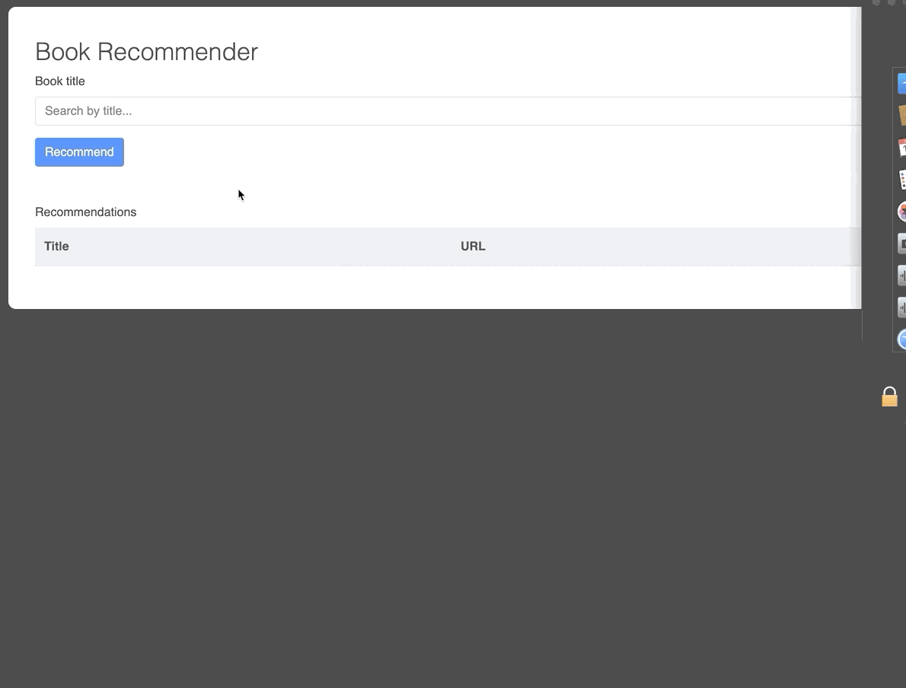

# Book Recommendation System
> A fullstack(ish) data science project to build a book recommendation system.

This project aims to create a book recommendation system.  It will target many areas of data science.  At a high level, the steps are:

* Source data (create a web spider to parse online data)
* Clean data (take scraped data and make it more useful)
* Explore data (understand the scraped data)
* Build system (create a recommendation system based on data)
* Deploy system (create a web service using the model)

## Books data source
This project uses the [GoodReads](https://www.goodreads.com) website as a data source.  GoodReads does [have an API](https://www.goodreads.com/api), but it mostly focuses on interaction with users.  In an ideal world, we'd source every possible book and its metadata, but this is of great scale and computationally expensive to use.  Instead, here are some alternative subsets:

### Popular user lists
GoodReads hosts [user lists](https://www.goodreads.com/list), which are collections of books curated by the users.  Some of these lists are substantial with over 55k books and hundreds of thousands of users, so it's potentially good.  GoodReads also provides links to the [most popular lists](https://www.goodreads.com/list/popular_lists).

### Popular books by year published
We can view the [top 200 books](https://www.goodreads.com/book/popular_by_date/2019/) published in any given year.

### Book awards
GoodReads [hosts book awards](https://www.goodreads.com/award) and maintains lists of the previous winners.  We could pick a popular award category and trace it back through the years.

## Deployment
This project uses [Flask](https://palletsprojects.com/p/flask/) for deployment.  **It is not supposed to be a production-ready deployment, but a proof of concept for exporting the technology to a browser.**  Please see below for an example:

